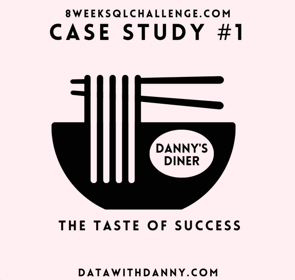

<p align="center">
  
</p>

<br />

<h1 align="center"> 🍜 Introduction </h1>

## Danny's Diner is a newly opened restaurant that specializes in Japanese cuisine, sushi, curry, and ramen.
## In the early months of 2021, Danny decides to start his venture to fulfill his love for Japanese food.

## However, the restaurant is struggling to stay afloat, and Danny realizes that he needs to leverage the data collected from his business to make better-informed decisions.

<br />

## The primary objective of this data analysis project is to answer several questions about the customers visiting patterns, the amount of money they've spent, and their favorite menu items.

## This information will help Danny deliver a more personalized experience to his loyal customers, thereby increasing customer retention and loyalty.

<br /> <br />

<h1 align="center"> 🛠️ Research Questions </h1>
<br />

## 1. What is the total amount each customer spent at the restaurant?

```sql 
select
   	sales.customer_id as customer,
    concat('$', sum(menu.price) ) as total_amount
from sales
left join 
      menu
using(product_id)
group by 
    customer
order by 
    total_amount DESC
```


## 2. How many days has each customer visited the restaurant?
```sql

select customer_id, 
  count(distinct order_date) number_of_visit
from sales
group by 
  customer_id
order by 
  number_of_visit desc
```

## 3. What was the first item from the menu purchased by each customer?

```sql
select customer_id, product_name from (
  select sales.customer_id,sales.product_id, menu.product_name, DATE(sales.order_date) as purchase_date,
rank() over(partition by sales.customer_id order by sales.order_date) as purchase_item_rank
from sales
left join menu
  using(product_id) 
) as first_item_purchased

where purchase_item_rank = 1
```

## 4. What is the most purchased item on the menu and how many times was it purchased by all customers?

```sql
select product_name, 
  count(product_name) as product_nos_of_purchase
from sales
left join 
  menu
using(product_id)
group by 
  product_name
```

## 5. Which item was the most popular for each customer?

```sql
  select sales.customer_id, menu.product_name, count(sales.product_id) as total_purchase
from sales
left join menu
using(product_id)
group by sales.customer_id, menu.product_name
order by sales.customer_id, total_purchase desc
```

## 6. Which item was purchased first by the customer after they became a member?

```sql
select customer_id, product_name from
(
  select sales.customer_id, sales.order_date, menu.product_name,
    rank() over( partition by sales.customer_id order by sales.order_date) as rnk
  from sales 
  inner join members
    on sales.customer_id = members.customer_id
  left join menu
    on sales.product_id = menu.product_id
    where sales.order_date >= members.join_date
  
  ) as first_item_purchased

where rnk = 1
```

## 7. Which item was purchased just before the customer became a member?

```sql
select customer_id, product_name from
(
  select sales.customer_id, sales.order_date, menu.product_name,
    rank() over( partition by sales.customer_id order by sales.order_date) as rnk
  from sales 
  inner join members
  on sales.customer_id = members.customer_id
  left join menu
  on sales.product_id = menu.product_id
    where sales.order_date < members.join_date
  ) as first_item_purchased

where rnk = 1
```

## 8. What is the total items and amount spent for each member before they became a member?

```sql
select sales.customer_id, count(sales.product_id) total_product,  concat('$', sum(menu.price)) amount_spent  
from sales
inner join members
on sales.customer_id = members.customer_id
left join menu
on sales.product_id = menu.product_id
where sales.order_date < members.join_date
group by sales.customer_id
```

## 9.  If each $1 spent equates to 10 points and sushi has a 2x points multiplier - how many points would each customer have?

```sql
select sales.customer_id,
  sum(case when menu.product_name = 'sushi' then 20 * menu.price else 10*menu.price end)
from sales
left join menu
on sales.product_id = menu.product_id
group by sales.customer_id
order by sales.customer_id
```

## 10. In the first week after a customer joins the program (including their join date) they earn 2x points on all items, not just sushi - how many points do customer A and B have at the end of January?

<br>

## Bonus Question

```sql
select sales.customer_id, sales.order_date::date,
  menu.product_name, menu.price,
  (case when sales.order_date < members.join_date then 'N'
 		when members.join_date is null then 'N'
    else 'Y' end) as member
from sales
left join members
on sales.customer_id = members.customer_id
left join menu
on sales.product_id = menu.product_id
order by sales.customer_id, sales.order_date
```


```sql
with member_rank as (
  select sales.customer_id, sales.order_date::date,
  menu.product_name, menu.price,
  (case when sales.order_date < members.join_date then 'N'
 		when members.join_date is null then 'N'
  else 'Y' end) as member
from sales
left join members
on sales.customer_id = members.customer_id
left join menu
on sales.product_id = menu.product_id
order by 
  sales.customer_id, sales.order_date
)

select *,
  case when member = 'N' then null
  else rank() over(partition by customer_id, member order by order_date) end as ranking from member_rank


